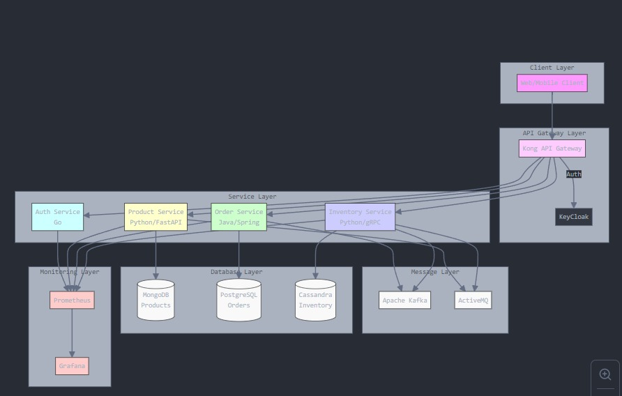

# Microservices-Based Enterprise Application Architecture

This project showcases a modern **microservices-based architecture** for a scalable and efficient enterprise application. The system is designed with modularity, fault tolerance, and seamless communication between services, ensuring reliable performance under varying workloads.



---

## Features

- **Microservices Architecture**: Independent services for authentication, product management, order processing, and inventory management.
- **API Gateway**: Centralized API management for secure and optimized communication.
- **Scalable Databases**: A combination of MongoDB, PostgreSQL, and Cassandra to handle diverse data requirements.
- **Asynchronous Communication**: Event streaming using Apache Kafka and message queuing with ActiveMQ.
- **Monitoring & Visualization**: Real-time performance monitoring with Prometheus and Grafana.
- **Robust Security**: Authentication and authorization powered by Keycloak.

---

## Technologies Used

### Programming Languages and Frameworks:
- **Go**: Authentication Service
- **Python/FastAPI**: Product Service
- **Java/Spring**: Order Service
- **Python/gRPC**: Inventory Service

### Databases:
- **MongoDB**: For product data.
- **PostgreSQL**: For order data.
- **Cassandra**: For inventory data.

### Messaging:
- **Apache Kafka**: Event streaming between microservices.
- **ActiveMQ**: Reliable message queuing.

### API Gateway and Security:
- **Kong API Gateway**: Routing and API management.
- **Keycloak**: Identity and access management.

### Monitoring:
- **Prometheus**: Metrics collection and alerting.
- **Grafana**: Data visualization for performance tracking.

---

## System Components

1. **Client Layer**:
   - Web and Mobile Clients provide the user interface for interacting with the application.

2. **API Gateway Layer**:
   - The **Kong API Gateway** ensures secure routing of API requests.
   - **Keycloak** manages user authentication and authorization.

3. **Service Layer**:
   - **Auth Service**: Handles user authentication (Go).
   - **Product Service**: Manages products (Python/FastAPI).
   - **Order Service**: Processes orders (Java/Spring).
   - **Inventory Service**: Tracks inventory levels (Python/gRPC).

4. **Database Layer**:
   - **MongoDB**: Stores product-related data.
   - **PostgreSQL**: Maintains order data.
   - **Cassandra**: Tracks inventory records.

5. **Message Layer**:
   - **Apache Kafka**: Enables event-driven communication between services.
   - **ActiveMQ**: Provides reliable message delivery.

6. **Monitoring Layer**:
   - **Prometheus**: Tracks system health and collects metrics.
   - **Grafana**: Visualizes performance data.

---

## Getting Started

### Prerequisites
- Docker
- Kubernetes (optional for deployment)
- API testing tools like Postman

### Installation

1. Clone the repository:
   ```bash
   git clone https://github.com/your-username/your-repo.git
   cd your-repo

2. Set up the environment:
- Create `.env` files for each service with the required environment variables.

3. Build and run the microservices using Docker:
Run the following command to build and start all services:
```bash
docker-compose up --build.

4. Access the Application

- **API Gateway:** [http://localhost:8000](http://localhost:8000)
- **Monitoring Dashboard:** [http://localhost:3000](http://localhost:3000) (Grafana)
